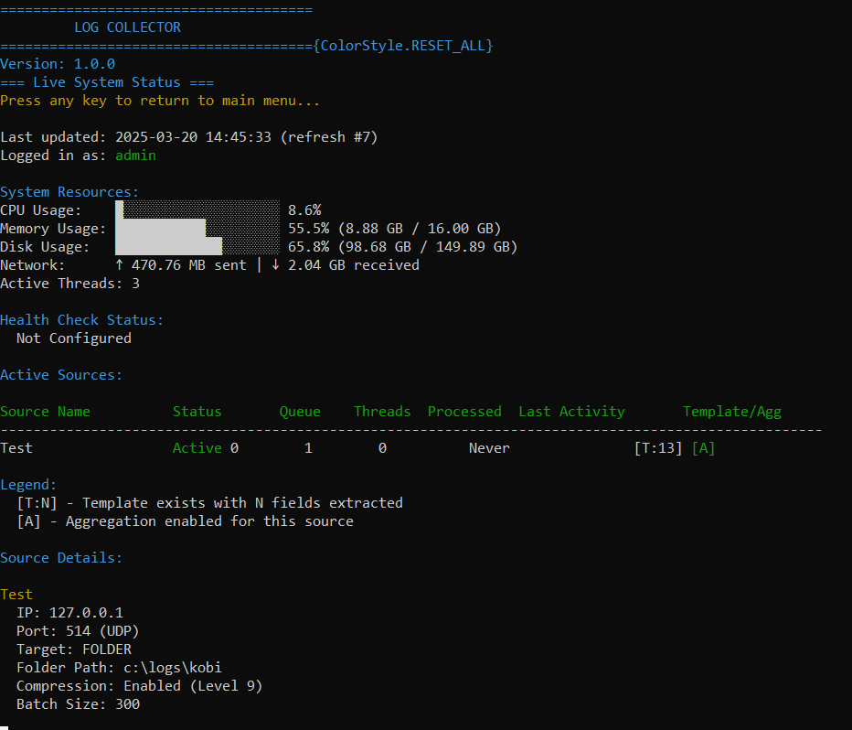

# Log Collector

A high-performance log collection and processing system capable of handling up to 20,000 events per second (EPS) with efficient in-memory processing. Log Collector can receive logs via TCP or UDP, process them using customizable rules, and forward them to either a file system folder or a HTTP Event Collector (HEC) endpoint.


## Features

### High Performance

- **In-Memory Processing**: All log processing occurs in memory for maximum throughput
- **20,000+ EPS Capacity**: Handles over 20,000 events per second with minimal resource utilization
- **Dynamic Scaling**: Automatically spawns additional processing threads based on queue size
- **Non-Blocking I/O**: Optimized for continuous operation even under heavy load

### Flexible Input

- **Multiple Sources**: Configure unlimited log sources with independent processing
- **Protocol Support**: Receive logs via both TCP and UDP protocols
- **Port Sharing**: Multiple sources can share the same listening port with IP-based filtering
- **JSON Parsing**: Automatically detects and parses JSON-formatted logs

### Advanced Processing

- **Log Aggregation**: Reduce log volume with customizable aggregation rules
- **Field Extraction**: Automatically extract fields from structured and unstructured logs
- **Filtering Rules**: Configure rules to filter out unwanted log events
- **Template Learning**: Automatically learns log structure from initial events

### Storage Options

- **Dual Output Options**: Send logs to filesystem or HEC endpoints
- **High Compression**: Enable GZIP compression for efficient storage
- **Configurable Batching**: Optimize performance with customizable batch sizes
- **Network Share Support**: Store logs directly to network shares for centralized collection

### Management and Security

- **User-Friendly CLI**: Interactive command-line interface for easy management
- **Authentication**: Secure password-based authentication system
- **Health Monitoring**: Integrated health checks and performance monitoring
- **Auto-Updates**: Built-in update checking and application management
- **Service Management**: Run as a system service on Windows and Linux

## Dashboard View



## Installation

### Prerequisites

- Python 3.7 or higher
- pip (Python package installer)

### Installation Methods

#### Method 1: Install from PyPI

```bash
pip install log-collector
```

#### Method 2: Install from Source

```bash
git clone https://github.com/hawk1811/Log_Collector.git
cd log_collector
pip install -e .
```

#### Method 3: Build Standalone Executable

For Windows:
```bash
cd log_collector
build-win.bat
```

For Linux:
```bash
cd log_collector
chmod +x build-lin.sh
./build-lin.sh
```

The standalone executables will be created in the `dist` directory, along with a zip file containing the application.

## Quick Start

Start the application with the CLI interface:

```bash
log_collector
```

Default username and password:

```
user: admin
pass: password
```

## Command-Line Options

Log Collector supports various command-line options:

```
usage: log_collector [-h] [--version] [--no-interactive] [--daemon] [--data-dir DATA_DIR]
                     [--log-dir LOG_DIR] [--pid-file PID_FILE] [--log-file LOG_FILE]
                     [--service {start,stop,restart,status,install}] [--interactive]

options:
  -h, --help            show this help message and exit
  --version             Show version information and exit
  --no-interactive      Run in non-interactive mode (for service deployment)
  --daemon              Run as a background daemon (detached from terminal)
  --data-dir DATA_DIR   Path to data directory
  --log-dir LOG_DIR     Path to log directory
  --pid-file PID_FILE   Path to PID file when running as daemon
  --log-file LOG_FILE   Path to service log file

Service commands:
  --service {start,stop,restart,status,install}
                        Manage the Log Collector service
  --interactive         Run service in interactive/foreground mode
```

### Common Usage Examples

Run without the interactive interface (for service mode):

```bash
log_collector --no-interactive
```

Run as a background daemon (detached from terminal):

```bash
log_collector --no-interactive --daemon
```

Specify a PID file location:

```bash
log_collector --no-interactive --daemon --pid-file=/var/run/log_collector.pid
```

Manage the service:

```bash
# Start the service
log_collector --service start

# Check service status
log_collector --service status

# Stop the service
log_collector --service stop

# Restart the service
log_collector --service restart

# Install as a Windows service (Windows only)
log_collector --service install
```

## Configuration

### Adding a Source

1. Start the Log Collector CLI
2. Select option 1 to add a new source
3. Enter the required information:
   - Source Name: A descriptive name for the source
   - Source IP: The IP address from which logs will be received
   - Listener Port: The port to listen on
   - Protocol: UDP (default) or TCP
   - Target Type: Folder or HEC
   - Target-specific settings:
     - For Folder: Folder path, batch size, and compression options
     - For HEC: HEC URL, token, and batch size


### Managing Sources

Select option 2 from the main menu to:
- View all configured sources
- Edit source settings
- Delete sources
- Manage aggregation rules
- Configure filter rules

### Aggregation Rules

Aggregation rules allow you to reduce log volume by combining similar log events:

1. Select "Manage Aggregation Rules" from the source management menu
2. Create a new rule by selecting fields that identify similar logs
3. The system will automatically combine logs that match on these fields


### Filter Rules

Filter rules let you exclude unwanted logs from processing:

1. Select "Manage Filter Rules" from the source management menu
2. Create filters based on field values
3. Logs matching these filters will be excluded from processing


## Architecture

The Log Collector system consists of the following main components:

- **Source Manager**: Handles source configuration and validation
- **Listener**: Receives logs from various sources via TCP/UDP
- **Processor**: Processes logs and delivers them to targets
- **Aggregation Manager**: Manages log templates and aggregation rules
- **Filter Manager**: Applies filtering rules to incoming logs
- **Health Check**: Monitors system and source health
- **Service Manager**: Manages service lifecycle and status
- **Authentication**: Handles user authentication and password management

Each source has dedicated threads:
1. A listener thread that receives logs
2. One or more processor threads that process and deliver logs

Additional processor threads are automatically spawned when the queue size exceeds 10,000 logs.

## Service Management

Log Collector can run as a background service on both Windows and Linux:

### Windows Service

On Windows, Log Collector can be installed as a Windows Service:

```bash
log_collector --service install
```

This registers Log Collector as a system service that will start automatically on system boot.

You can then manage the service using the standard Windows Service tools or with:

```bash
log_collector --service start
log_collector --service stop
log_collector --service restart
log_collector --service status
```

### Linux Daemon

On Linux, Log Collector can run as a daemon process:

```bash
log_collector --daemon --pid-file=/var/run/log_collector.pid
```

You can also use the `--service` commands to manage the daemon:

```bash
log_collector --service start
log_collector --service stop
log_collector --service restart
log_collector --service status
```

## Log Format

Logs are processed into the following JSON format:

```json
{
  "time": 1647586245,
  "event": "Original log string or parsed JSON object",
  "source": "source_name"
}
```

If the incoming log is a valid JSON object, it's parsed and included as the event value. Otherwise, the raw string is used.

## Health Monitoring

The health monitoring feature collects the following data:
- CPU usage and load
- Memory usage
- Disk usage
- Network I/O
- Source-specific metrics (queue size, active processors)

This data is sent to a configured HEC endpoint at regular intervals.

## Performance Tuning

- Batch sizes can be configured per source:
  - Default for HEC targets: 500 logs per batch
  - Default for Folder targets: 5000 logs per batch
- Queue limits trigger additional processor threads (default: 10,000 logs)
- Compression level is configurable (1-9, with 9 being highest compression)
- Adjust these values based on your specific requirements and hardware capabilities

## Updates and Maintenance

Log Collector includes a built-in update mechanism that can check for updates, pull changes from Git, and upgrade the application:

1. Select "Check for Updates" from the main menu
2. If updates are available, you'll see a summary of changes
3. Confirm to download and apply the updates
4. The application will restart automatically after updating

## Requirements

See `requirements.txt` for detailed dependencies. Core requirements include:

- requests>=2.25.0
- psutil>=5.8.0
- prompt_toolkit>=3.0.20
- colorama>=0.4.4
- bcrypt>=3.2.0
- cryptography>=35.0.0

## License

MIT License

## Support

For issues and feature requests, please open an issue on the GitHub repository.
